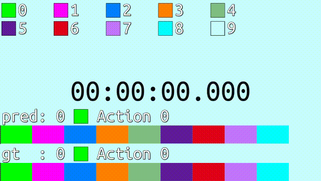
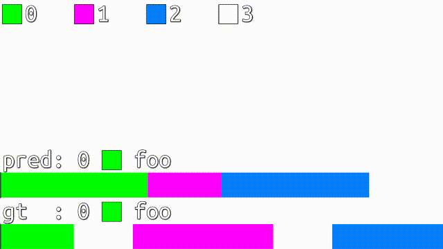

# VISTAL: A visualization tool for temporal action localization

<p align="center" width="100%">
    
</p>

A lightweight tool for visualizing temporal action localization results. It generates .ass subtitle files containing timelines for videos.


## Installation

```
pip install vistal
```


## Tutorial

Import the library

```python
from vistal import vistal, ColourScheme, Colour
```

Pack the temporal labels into a list of `tuple(start, end, label_id)`, for example:

```python
prediction = [
    # start, end, label_id
    ( 0,     2,     0),
    ( 2,     3,     1),
    ( 3,     5,     2),
    ( 5,     6,     3),
]
```

`start` and `end` are integers or floats in seconds, and `label_id` are integer IDs for each action. It is best that the whole video duration is covered by `(start, end)` sections.

And the actual temporal label, for example, is

```python
ground_truth = [
    ( 0,     1,     0),
    ( 1,     1.8,   3),
    ( 1.8,   3.7,   1),
    ( 3.7,   4.5,   3),
    ( 4.5,   6,     2),
]
```

And another `dict` maps from label IDs to their names:

```python
label_names = {
    0: 'foo',
    1: 'bar',
    2: 'baz',
    3: 'background',
}
```

Now we create a colour scheme to determine what colour to represent each action:

```python
colour_scheme = ColourScheme(
    colours=[
        Colour(b=255, g=0,   r=0),
        Colour(b=0,   g=255, r=0),
        Colour(b=0,   g=0,   r=255),
        Colour(alpha=255),
    ]
)
```

Or, we can generate some random colours. The last action is background, therefore it should be transparent.

```python
colour_scheme = ColourScheme(n_colours=4, transparent_id=3)
```

Suppose the video resolution is 1280x720, and it lasts for 6 seconds:

```python
display_width = 1280
display_height = 720
video_duration = 6
```

The main function `vistal` creates a subtitle object:

```python
sub = vistal(
    temporal_list_dict={
        'gt  ': ground_truth,
        'pred': prediction
    },
    label_names=label_names,
    colour_scheme=colour_scheme,
    video_duration=video_duration,
    display_width=display_width,
    display_height=display_height,
    timeline_height=72,
    font_size=72,
    font_name='Ubuntu Mono',
    show_legend=True,
)
```

Save to an `.ass` file:

```python
sub.save('tutorial.ass')
```

Finally, play the video and load the subtitle to the player. Make sure your video player supports `.ass` subtitle, for example PotPlayer. (It is noticed that VLC Player sometimes does not display the timeline.) Here is how it looks like on a blank video:

<p align="center" width="100%">
    
</p>

For another complete example, see [example.py](./example.py).
